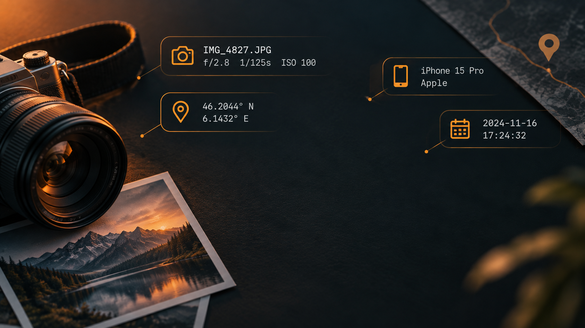

# Bare

**See what your photos and videos say about you — then strip it, entirely on your own device.**



Every photo and video carries hidden data most people never see: where it was taken, when, and on what device. Bare finds it, shows it to you plainly — including on a real offline map — and removes it. Nothing is ever uploaded anywhere; check your browser's network tab, or switch to airplane mode, and it still works.

🔗 **[Try it live](https://matspub.github.io/Bare/)**

## What it does

- Reads hidden GPS location, device make/model, and timestamp
- Shows exactly what it found before touching anything
- Strips it all with one tap — losslessly for video, with minimal quality loss for photos
- Re-scans its own output afterward and tells you honestly whether it actually worked

## Supported formats

**Photo — JPEG.** Reads and strips EXIF metadata: GPS, device make/model, timestamp. The most thoroughly tested format.

**Photo — PNG.** Reads and strips the `eXIf` chunk when present (PNG's official mechanism for carrying the same EXIF data), plus removes all other non-essential chunks. Verified against a hand-built test file with real EXIF/GPS data inside; not yet tested against a wide range of real-world PNGs, since cameras rarely produce them.

**Video — MP4.** Reads and strips GPS, device info, and timestamps directly from the container. Verified against several real encoder-generated files, few real recordings, and a file layout specifically chosen because it could cause corruption if handled incorrectly — confirmed the output still plays back correctly and the actual video data is byte-for-byte untouched.

**Video — MOV / QuickTime.** Runs through the exact same code as MP4, since both share the same underlying container format. Accepted by the file picker, but not yet verified against a real `.mov` file.

**Not supported:** WebM, AVI, MKV, or any other video container. Bare understands one specific box-based format, not video in general.

## Why trust it

The entire thing is plain, readable JavaScript — no build step, no bundler, no minification hiding what it does. Read it yourself, or just watch the network tab while you use it.

## Running it locally

No build step needed. Clone the repo and serve the folder with any static file server, example:

```
python3 -m http.server 8000
```

Then open `http://localhost:8000`.

## License

GPLv3 — see [LICENSE](LICENSE).

## Credits

Map data from [Natural Earth](https://www.naturalearthdata.com/) (public domain).
